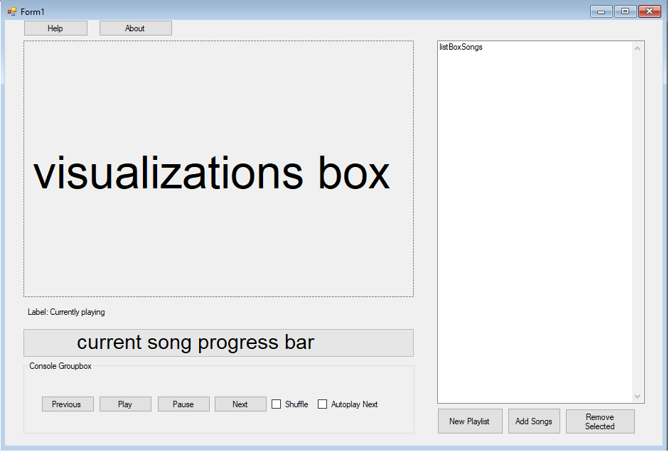

# 1.Introduction  [Done: Cosmin Popovici]

## 1.1 Purpose

Main purpose of this project is designing, implementing and testing an Audio Player application for Windows.
Because it is intended to be an academic project, GUI of the Audio Player isn't very sophisticated and the parts that represents the main focus are the design patterns and other backend details.

## 1.2 Definitions, Acronyms and Abberviations

An Audio Player is a software or hardware (or both) entity capable of playing a list of music files.This entity is capable of playing a song, playing next or previous song, pausing or stopping a song and shuffling the list of songs.

A playlist is a list of music files (songs).

GUI = Graphical User Interface

IDE = Integrated Development Environment

MIDI = Musical Instrument Digital Interface

## 1.3 Intended Audience

From the perspective of using the application, the Audio Player can be used by any person of any age.
From the perspecting of reading the code source of the application, it can be read by any programmer who want study an example of project which brings together design patterns, Windows Forms, C# events and delegates and the principles of designing an audio player application.

## 1.4 References 

C# 7.0 in a Nutshell: The Definitive Reference, Joseph Albahari and Ben Albahari
Windows Forms Programming in C#, Chris Sells

# 2. Overall description [DONE: Bogdan Vacariuc]
## 2.1 Product Perspective 
The Audio Player is a desktop application and hence will require an operating system installed on the machine which has to be <b>Windows</b>. 
It will use .NET 4.7.2 for its development. The package is independent of any other application.

## 2.2 Product Functions 
The product is supposed to serve as an audio player, providing a simple mechanism for users to use it. 

The following are the main features that are included in the Audio Player: 
* Accepts a large diversity of sound formats
* Playlists can be obtained by loading melodies
* The playlist is listed and any melody can be selected
* Can navigate through each melody using <b>previous</b> and <b>next</b> buttons
* The playlist can be shuffled

## 2.3 User Characteristics 
It is considered that users do have the basic knowledge to use this product.

## 2.4 General Constraints 
The product will work on machines that run <b>Windows</b> operating system. Also, the user should have melodies on his hard drive to load them in the application and listen to music.

## 2.5 Assumptions and Dependencies 
This software does not have any other dependencies than the operating system and sound formats. It is assumed that the user allows access to the directories that contain melodies.

# 3. Specific Requirements [DONE: Andrei Cana ]

### This is a self contained audio player. Its functionality is to play songs of different supported formats. 
### The audio player has to be able to create playlists, add songs to them and playback songs in sequential or random mode. 
### The audio player has to show progress of the current song being played.
### The audio player has to have a form of visualization for the song - in the form of frequency displays or song-related album art.

## 3.1	External Interface Requirements 

The Audio Player is a self contained system that does not communicate over the internet with any other third party.

All functionality is achieved with the use of the .NET 4.7.2 framework and the open source NAudio library.

NAudio - Audio and MIDI library for .NET
[GitHub](https://github.com/naudio/NAudio)

## 3.1.1 User Interfaces 

The program will have one single Form / panel from which all functions will be exposed to the user. A mockup of the design is below. 

Windows Forms components are used for quick and functional feature implementation. They are, as follows:

* Previous : plays previous song (whether it's previous by index or previous from shuffle)
* Play: resume playing the current song (if it isn't already playing)
* Pause: pauses the current song (button is separated from play so that play can be used in the context of a new song
* Next: plays next song (whether by next index or randomly generated index in the case of shuffle)
* Shuffle: toggles between playing songs sequentially and randomly 
* Autoplay Next: toggles between playing next song automatically and not doing that

* About: displays information about the project, its context and authors
* Help: displays the helpdoc

* Remove Selected: Remove the currently selected song(s) 
* Add songs: Populate the current playlist by browsing to a folder and reading recursively from it
* New Playlist: creates a new playlist (that will be persisted as a .txt of the paths to the songs)

## 3.1.2 Hardware Interfaces 

The program relies on .NET interfaces with the operating system that expose the audio device driver. It does not communicate directly with any hardware component.

## 3.1.3 Software Interfaces 

The program uses NuGet package manager for managing its dependencies. This is integrated as an IDE extension and facilitates quick package installation and management.

The program uses NAudio as an extensive .NET audio library. It facilitates encoding, decoding and playback using different engines for multiple file types.

## 3.1.4 Communication Interfaces 

The app only communicates with the operating system to access the file system when browsing for songs on local storage. This is basic WinForms functionality.

## 3.2 Functional Requirements 

* 3.2.1 The app must be capable of allowing the user to create playlists using local folders with audio files
* 3.2.2 The app must be capable of ignoring non-audio files when loading the playlist or adding songs
* 3.2.3 The app must be capable of playing the current song and tracking it's progress
* 3.2.4 The app must be capable of pausing the current song and unpausing it
* 3.2.5 The app must be capable of switching to playing a new song while the last one isn't finished
* 3.2.6 The app must be capable of persisting the user created playlists (i.e. they don't vanish when the app is closed)
* 3.2.7 The app must be capable of song playback in sequential or shuffle mode
* 3.2.8 The app must be capable of allowing the user the choice of whether the next song is automatically played

## 3.3 Performance requirements 

### The app has to be responsive (i.e. the time between a user generated event / click and the action must not be noticeable)

## 3.4 Design Constraints

None. 

## 3.5 Other

This app is developed as part of a university project, thus the code and all intellectual property is licensed as open source.  
